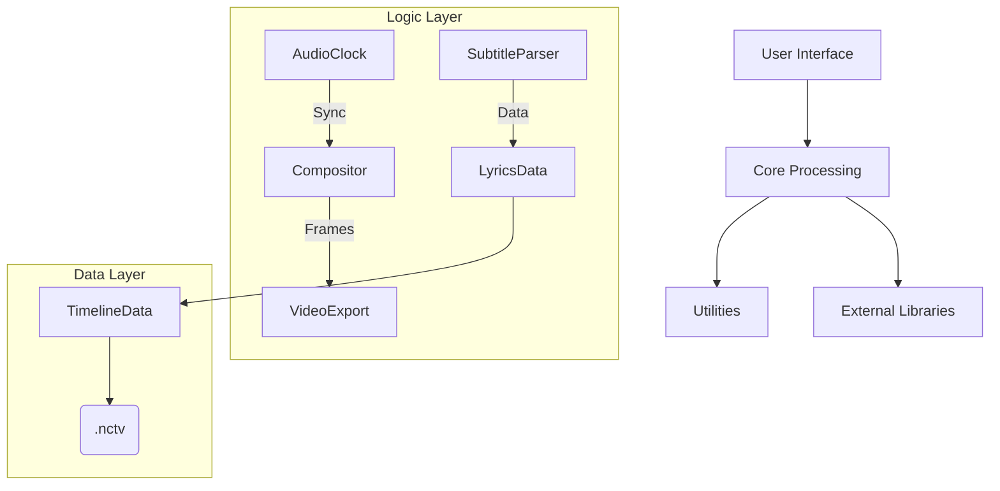
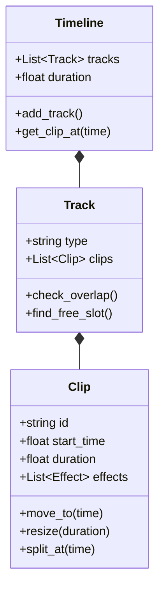

# NC-KTV Technical Documentation

**Version:** 0.8.0
**Last Updated:** January 3, 2026

Comprehensive technical documentation covering the internal architecture, mathematical models, and algorithms used in the NC-KTV karaoke suite.

---

## 📑 Table of Contents

1. [Architecture Overview](#architecture-overview)
2. [Timing Synchronization System](#timing-synchronization-system)
3. [Audio Processing Pipeline](#audio-processing-pipeline)
4. [Subtitle Parsing Algorithms](#subtitle-parsing-algorithms)
5. [Effect Compositor (Bezier Math)](https://www.google.com/search?q=%23effect-compositor-bezier-math)
6. [Karaoke Animation Algorithms](#karaoke-animation-algorithms)
7. [Timeline Data Model](#timeline-data-model)
8. [Video Export Engine](#video-export-engine)

---

## Architecture Overview

NC-KTV follows a modular architecture decoupling audio processing from UI rendering.



---

## Timing Synchronization System

### 1. AudioClock Mathematics

The system avoids floating-point drift by tracking time in **samples**, not seconds.

**Time Conversion Formulas:**

Let $t_{seconds}$ be time in seconds and $f_s$ be the sample rate (e.g., 48000 Hz).

```math
N_{samples} = \lfloor t_{seconds} \times f_s \rfloor
```

```math
t_{seconds} = \frac{N_{samples}}{f_s}
```

**Latency Compensation Model:**

To obtain the corrected synchronization time $t_{sync}$, we sum the raw playback time with the master offset and cumulative processing latencies:

```math
t_{sync} = t_{raw} + \Delta_{master} + \sum_{i} L_i
```

Where:
* $t_{raw}$: Raw timestamp from audio driver
* $\Delta_{master}$: User-calibrated global offset (adjustable ±5000ms)
* $L_i$: Individual latencies (UVR processing, Transcription delay, Audio buffer)

**Sample Rate Drift:**

When mixing audio sources with different sample rates (e.g., $f_{src}=44.1$kHz, $f_{tgt}=48$kHz) without resampling, drift $\delta$ accumulates over duration $D$:

```math
\delta = \left| 1 - \frac{f_{src}}{f_{tgt}} \right| \times D
```

*Example:* For a 180s song, drift $\approx 14.6$ seconds (Significant desynchronization).

---

## Audio Processing Pipeline

### 2. UVR Separation (Spectral Isolation)

Vocal separation uses the **Short-Time Fourier Transform (STFT)** to convert time-domain signals to the frequency domain for masking.

**STFT Equation:**

```math
X(m, k) = \sum_{n=-\infty}^{\infty} x(n) \cdot w(n - mH) \cdot e^{-j \frac{2\pi}{N} k n}
```

* $x(n)$: Input signal
* $w(n)$: Window function (Hann)
* $H$: Hop size
* $N$: FFT size

### 3. Automatic Delay Calibration

To align the instrumental track $y(n)$ with the original track $x(n)$, we compute the **Cross-Correlation** $R_{xy}$ and find the lag $\tau$ that maximizes it:

```math
\tau_{optimal} = \underset{\tau}{\operatorname{argmax}} (R_{xy}(\tau)) = \underset{\tau}{\operatorname{argmax}} \left( \sum_{n} x(n) \cdot y(n + \tau) \right)
```

---

## Detection Algorithms

### 4. Neural Vocal Separation (MDX-Net)

MDX-Net operates as a **Frequency Masking** model. It predicts a soft mask $M$ to separate the spectrogram of the vocals $S_v$ from the mixture $S_{mix}$.

1.  **Input:** Spectrogram $S_{mix} = \text{STFT}(x)$
2.  **Inference:** $\hat{M}_v = \text{Network}(S_{mix})$
3.  **Masking:** $\hat{S}_v = S_{mix} \odot \hat{M}_v$ (Element-wise multiplication)
4.  **Reconstruction:** $\hat{v}(t) = \text{iSTFT}(\hat{S}_v)$

The loss function effectively minimizes the L1 distance between estimated and ground truth spectrograms:

```math
\mathcal{L} = || S_v - \hat{S}_v ||_1 + || S_{other} - \hat{S}_{other} ||_1
```

### 5. Lyrics Transcription (Whisper)

Whisper uses an encoder-decoder Transformer architecture trained on Log-Mel Spectrogram features.

**Feature Extraction:**
Audio samples $x$ are converted to Log-Mel Spectrogram features $X$:
1.  **STFT**: Window length 25ms, stride 10ms.
2.  **Mel Filterbank**: Project to 80 Mel frequency bins.
3.  **Log:** $X = \log(S_{mel} + \epsilon)$

**Attention Mechanism:**
The core detection logic relies on **Scaled Dot-Product Attention**:

```math
\text{Attention}(Q, K, V) = \text{softmax}\left(\frac{QK^T}{\sqrt{d_k}}\right)V
```

Where $Q$ (Query) comes from the decoder (lyrics context), and $K, V$ (Key, Value) come from the encoder (audio features), allowing the model to "attend" to specific audio segments while generating each word.

## Subtitle Parsing Algorithms

NC-KTV unifies various subtitle formats into a common `LyricsData` structure.

### 4. Timestamp Conversion Formulas

**SubRip (SRT) & WebVTT:**
Format: `HH:MM:SS,mmm` (SRT) or `HH:MM:SS.mmm` (VTT)

```math
t = (HH \times 3600) + (MM \times 60) + SS + \frac{mmm}{1000}
```

**LRC (Lyrics):**
Format: `[MM:SS.xx]` (where xx is centiseconds)

```math
t = (MM \times 60) + SS + \frac{xx}{100}
```

**ASS/SSA:**
Format: `H:MM:SS.cc`

```math
t = (H \times 3600) + (MM \times 60) + SS + \frac{cc}{100}
```

```math
t = (H \times 3600) + (MM \times 60) + SS + \frac{cc}{100}
```

### 4b. Inverse Conversion (Export)
The system also supports losslessly converting `LyricsData` back to these formats for interoperability.
1. **Normalization**: All timestamps are internally float seconds.
2. **Formatting**:
   - `float_to_vtt(t)` -> `HH:MM:SS.mmm`
   - `float_to_ass(t)` -> `H:MM:SS.cc`

---

## Effect Compositor (Bezier Math)

Smooth animations (fades, slides, scaling) are driven by **Cubic Bezier Curves**.

### 5. Cubic Bezier Function

For a normalized time $t \in [0, 1]$, the interpolated value $B(t)$ is defined by four control points $P_0, P_1, P_2, P_3$:

```math
B(t) = (1-t)^3 P_0 + 3(1-t)^2 t P_1 + 3(1-t) t^2 P_2 + t^3 P_3
```

Standard animations set fixed anchors: $P_0 = (0,0)$ and $P_3 = (1,1)$. The curve shape is controlled by $P_1$ and $P_2$.

### 6. Property Interpolation

Once the eased progress $p = B(t)$ is calculated, the property value $V$ at time $t$ is:

```math
V(t) = V_{start} + p \times (V_{end} - V_{start})
```

---

## Karaoke Animation Algorithms

### 7. Linear Wipe (Fill Effect)

Calculates the width of the highlighted text region $W_{fill}$ based on the current time $t_{curr}$ relative to the line's start ($t_{start}$) and end ($t_{end}$):

```math
p_{raw} = \frac{t_{curr} - t_{start}}{t_{end} - t_{start}}
```

```math
W_{fill} = W_{total} \times \operatorname{clamp}(p_{raw}, 0, 1)
```

### 8. Bouncing Ball Trajectory

The ball follows a parabolic path between two word centers $(x_1, y_{base})$ and $(x_2, y_{base})$.

**Horizontal Motion (Linear):**
```math
x(p) = x_1 + p \times (x_2 - x_1)
```

**Vertical Motion (Sinusoidal Arc):**
```math
y(p) = y_{base} - A \times \sin(\pi \times p)
```
*Where $A$ is the bounce amplitude and $p \in [0, 1]$ is the progress between words.*

---

## Video Export Engine

### 9. Color Space Conversion (HSL → RGB)

Used for "Rainbow" and "Color Shift" effects.

1.  **Chroma ($C$):** $C = (1 - |2L - 1|) \times S$
2.  **Intermediate ($X$):** $X = C \times (1 - |((H / 60) \pmod 2) - 1|)$
3.  **Lightness Match ($m$):** $m = L - C/2$

### 10. Alpha Blending

Composites the lyrics layer (Source, $S$) over the video background (Destination, $D$).

```math
C_{out} = \alpha_S C_S + (1 - \alpha_S) C_D
```

---

## Timeline Data Model

The timeline logic manages clips on multiple tracks, handling overlap and state.



---

## File Format (.nctv)

The project file uses a custom binary structure with **AES-256-GCM** encryption.

**Byte Layout:**

| Offset | Size | Field | Description |
| :--- | :--- | :--- | :--- |
| `0x00` | 4B | **Magic** | "NCTV" (ASCII) |
| `0x04` | 2B | **Version** | `0x0002` (v2.0) |
| `0x06` | 16B | **Salt** | PBKDF2 Salt |
| `0x16` | 12B | **IV** | AES-GCM Initialization Vector |
| `0x22` | ... | **Payload** | Encrypted JSON (Project Data) |
| `End` | 32B | **Tag** | GCM Authentication Tag |


## Syllable Editor Mechanics

The Fine-Tune Syllable Editor uses a precise coordinate system to map time to screen pixels.

### 11. Time-to-Pixel Mapping
The editor view is defined by a linear transformation scaled by the `pixels_per_second` ($PPS$) zoom factor.

For any timestamp $t$ (seconds):
```math
x_{pixel} = \lfloor t \times PPS \rfloor
```

Inverse mapping for mouse interaction (e.g., seek, click):
```math
t_{seconds} = \frac{x_{pixel}}{PPS}
```

### 12. Audio Waveform Rendering
To render the audio waveform efficiently on the canvas, we use a **Peak Envelope** optimization. Instead of drawing every sample (which would be millions of points), we compute Min/Max pairs for each visual pixel column.

Given audio data $A$ and pixel $i$ covering the time range $[t_{start}, t_{end}]$:

```math
Y_{min} = \min(A[t_{start}:t_{end}]) \times \frac{H}{2} + Y_{center}
```
```math
Y_{max} = \max(A[t_{start}:t_{end}]) \times \frac{H}{2} + Y_{center}
```

This ensures visually accurate representation of peaks even at low zoom levels.

## Intro Credits Construction

The intro credits feature concatenates a dynamically generated video clip $V_{intro}$ with the main song video $V_{song}$.

### 13. Dynamic Overlay Generation
The credit overlay is composited using FFmpeg's `drawtext` filter chain. 
The alpha channel $\alpha(t)$ for the fade-out effect over duration $D$ (e.g., 5s) and fade time $F$ (e.g., 1s) follows:

```math
\alpha(t) = \begin{cases} 
1 & \text{if } t < (D - F) \\
1 - \frac{t - (D - F)}{F} & \text{if } (D - F) \le t < D \\
0 & \text{if } t \ge D 
\end{cases}
```

---

*Verified Mathematical Models - NC-KTV Core Engineering*

---
