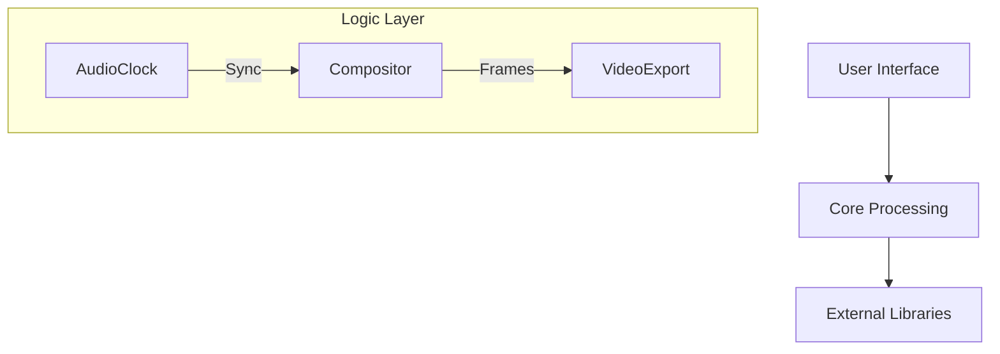

# NC-KTV Technical Documentation

**Version:** 2.0

**Last Updated:** January 3, 2026

**Format:** Universal Markdown (No Plugins Required)

Comprehensive technical documentation covering the internal architecture, mathematical models, and algorithms used in the NC-KTV karaoke suite.

---

## 📑 Table of Contents

1. [Architecture Overview](https://www.google.com/search?q=%23architecture-overview)
2. [Timing Synchronization System](https://www.google.com/search?q=%23timing-synchronization-system)
3. [Audio Processing Pipeline](https://www.google.com/search?q=%23audio-processing-pipeline)
4. [Effect Compositor (Bezier Math)](https://www.google.com/search?q=%23effect-compositor-bezier-math)
5. [Karaoke Animation Algorithms](https://www.google.com/search?q=%23karaoke-animation-algorithms)
6. [Video Export Engine](https://www.google.com/search?q=%23video-export-engine)

---

## Architecture Overview

NC-KTV follows a modular architecture decoupling audio processing from UI rendering.



---

## Timing Synchronization System

### 1. AudioClock Mathematics

The system avoids floating-point drift by tracking time in **samples** rather than seconds.

**Time Conversion Formulas:**

> **t_seconds** = n_samples / sample_rate
> **n_samples** = floor(t_seconds × sample_rate)

**Latency Compensation Model:**
To get the perfectly synced time (`t_corrected`), we sum the raw time with the master offset and all processing delays.

```math
t_corrected = t_raw + Δ_master + Σ(latencies)

```

Where:

* `t_raw` : Raw timestamp from audio driver
* `Δ_master` : User global offset (±5000ms)
* `Σ(latencies)` : Sum of UVR, Transcription, and Playback delays

**Sample Rate Drift:**
When mixing 44.1kHz audio on a 48kHz clock without resampling, drift occurs.

```math
Drift = | 1 - (SampleRate_source / SampleRate_target) | × Duration

```

*Example:* A 3-minute song (180s) at 44.1kHz played on 48kHz hardware:
`Drift ≈ |1 - 0.918| × 180s ≈ 14.6 seconds` (Major Desync)

---

## Audio Processing Pipeline

### 2. UVR Separation (Spectral Isolation)

The vocal separation relies on the **Short-Time Fourier Transform (STFT)**.

**STFT Equation:**
The transformation of audio signal `x(n)` into frequency domain `X(k, m)`:

```math
X(k, m) = Σ [ x(n) × w(n - mH) × e^(-j2πkn/N) ]

```

* **x(n)**: Input audio samples
* **w(n)**: Window function (Hann)
* **H**: Hop size (step size)
* **N**: FFT size (2048 or 4096)

### 3. Automatic Delay Calibration

To align the instrumental with the original track, we find the peak of the **Cross-Correlation (`R_xy`)**:

```math
Delay_samples = argmax( Σ [ x(n) × y(n + τ) ] )

```

---

## Effect Compositor (Bezier Math)

All smooth animations (fades, slides) use **Cubic Bezier Curves**.

### 4. Cubic Bezier Function

For a progress `t` (from 0 to 1), the curve value `B(t)` is calculated using control points `P0` to `P3`:

```math
B(t) = (1-t)³P₀ + 3(1-t)²tP₁ + 3(1-t)t²P₂ + t³P₃

```

Since animations usually start at 0 and end at 1, we simplify by setting `P₀=(0,0)` and `P₃=(1,1)`.

### 5. Interpolation Logic

Once the "eased" progress is calculated, the final property value (like Opacity or X-Position) is:

```math
Value_current = Value_start + Progress_eased × (Value_end - Value_start)

```

---

## Karaoke Animation Algorithms

### 6. Linear Wipe (Fill Effect)

Calculates how much of the lyrics line should be colored based on time.

```python
# 1. Calculate raw progress (0.0 to 1.0)
fill_progress = (t_current - t_start) / (t_end - t_start)

# 2. Clamp values to ensure it doesn't overshoot
fill_progress = clamp(fill_progress, 0.0, 1.0)

# 3. Calculate width in pixels
width_pixels = total_text_width * fill_progress

```

### 7. Bouncing Ball Trajectory

The ball follows a **Parabolic Arc** (sine wave) between two words (Word A to Word B).

**Horizontal (X):** Linear movement
`x(p) = start_x + p × (end_x - start_x)`

**Vertical (Y):** Sinusoidal Jump
`y(p) = baseline_y - Amplitude × sin(π × p)`

*Note: `sin(π × p)` creates a curve that starts at 0, peaks at 1 (middle), and ends at 0.*

---

## Video Export Engine

### 8. Color Space Conversion (HSL to RGB)

Used for the "Rainbow/Shift" effects.

**Formulas:**

1. **Chroma (C):** `C = (1 - |2L - 1|) × S`
2. **Intermediate (X):** `X = C × (1 - |((H / 60) mod 2) - 1|)`
3. **Lightness Match (m):** `m = L - C/2`

### 9. Alpha Blending (Layering)

Combines the Lyrics Layer (Source) onto the Background Video (Dest).

```math
Color_final = (Alpha_src × Color_src) + ((1 - Alpha_src) × Color_dest)

```

---

## File Format (.nctv)

The project file uses a binary structure with **AES-256** encryption.

**Byte Layout:**

| Offset | Size | Field | Description |
| --- | --- | --- | --- |
| `0x00` | 4B | **Magic** | "NCTV" (ASCII) |
| `0x04` | 2B | **Version** | `0x0002` (v2.0) |
| `0x06` | 16B | **Salt** | PBKDF2 Salt |
| `0x16` | 12B | **IV** | AES-GCM Initialization Vector |
| `0x22` | ... | **Data** | Encrypted JSON Payload |
| `End` | 32B | **HMAC** | Integrity Hash |

---
